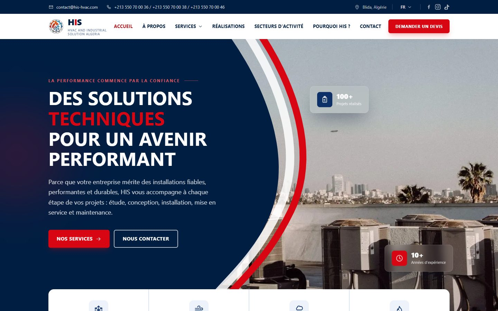
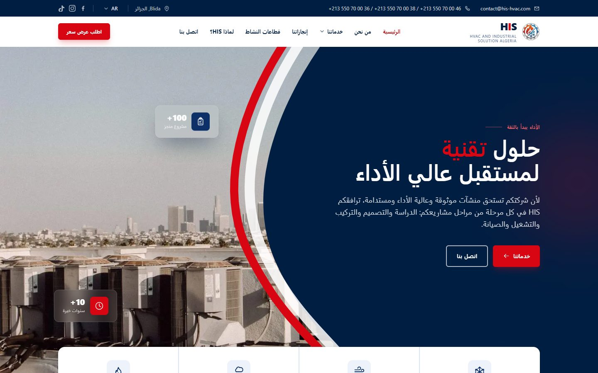
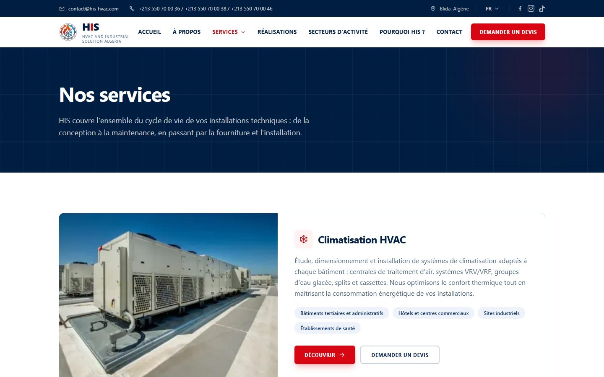
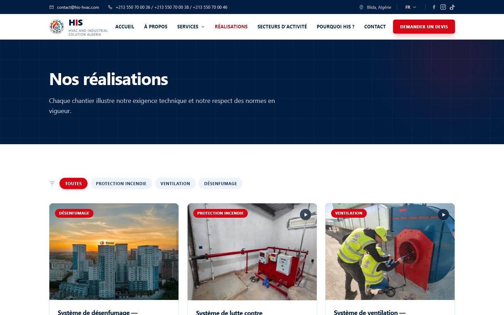
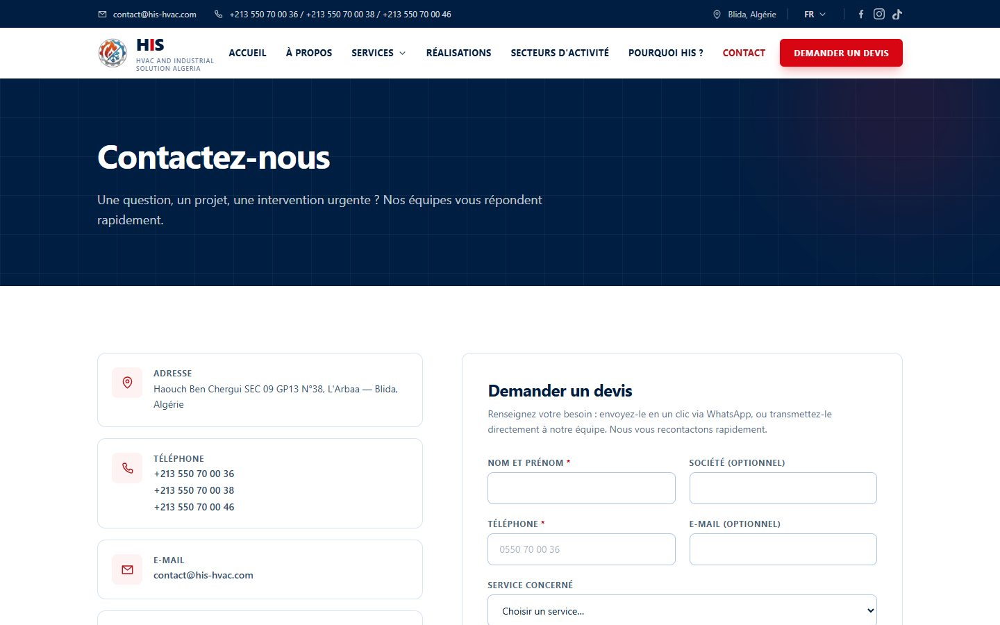
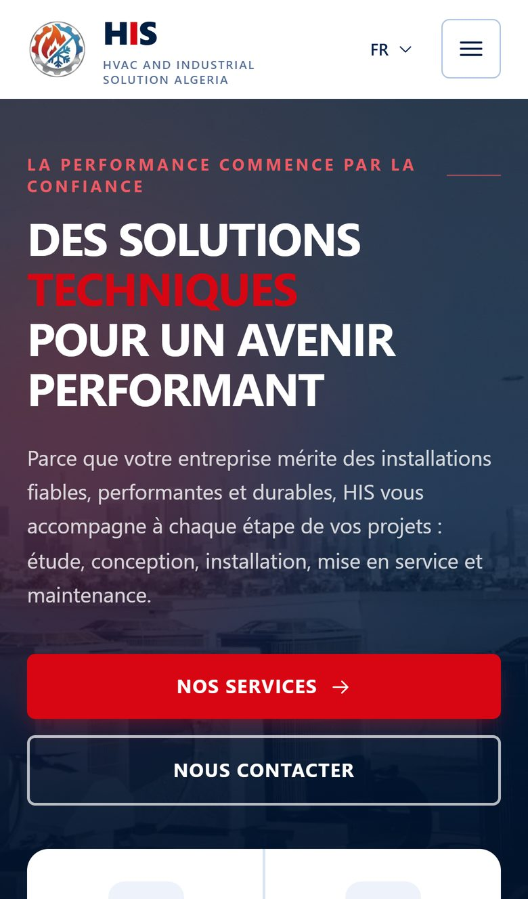
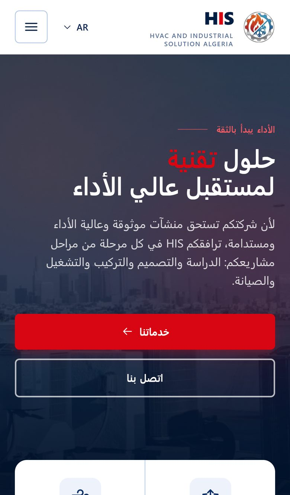
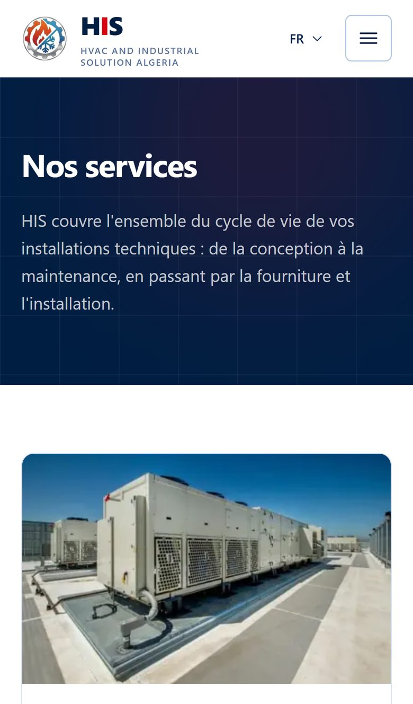
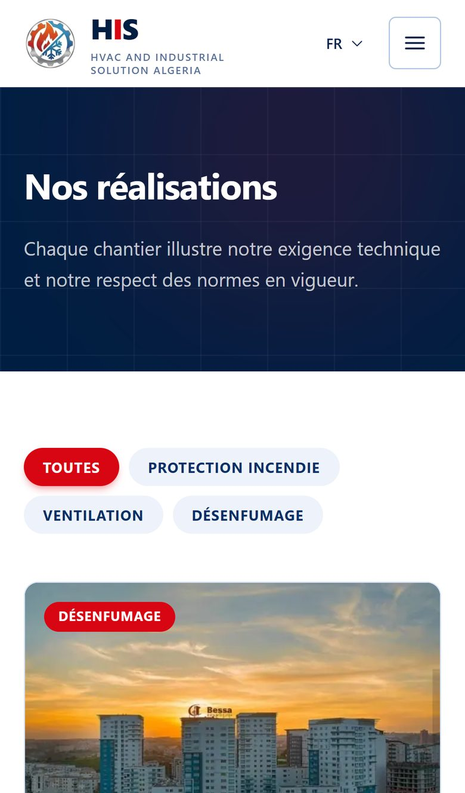
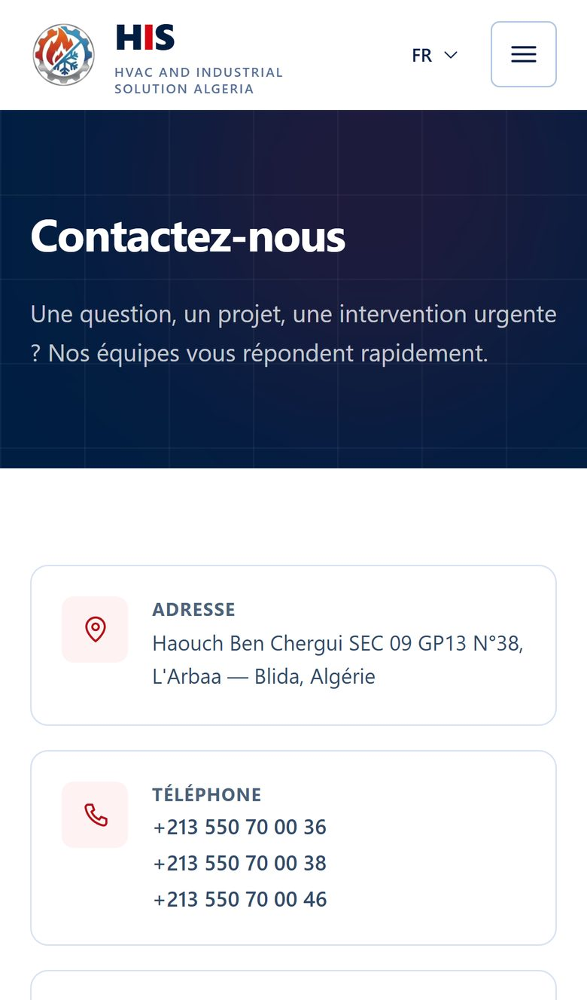

<div align="center">


# HIS — HVAC and Industrial Solution

**Official website and content management platform for HIS, an engineering company in Blida, Algeria. HIS designs, installs and maintains HVAC, smoke-control and fire-protection systems.**

[**www.his-hvac.com**](https://www.his-hvac.com) · Trilingual: Français · English · العربية


</div>

---

## Overview

HIS (HVAC and Industrial Solution Algeria) was founded by two engineers from ENP and USTHB. The company
covers the full life cycle of technical installations: engineering studies, supply, installation,
commissioning and maintenance.

The website does two jobs:

1. **A public showcase.** It presents the company's 9 services, its completed projects, the sectors it
   serves and its partners, and it turns visitors into quote requests through the contact form or
   WhatsApp.
2. **A private admin dashboard** (`/admin`). The client uses it to edit every piece of content in three
   languages, upload photos and videos, and manage incoming leads, with no developer involvement.

## Screenshots

### Desktop

| Home | Home — Arabic (RTL) |
| :---: | :---: |
|  |  |
| **Services** | **Projects** |
|  |  |
| **Contact & quote request** | |
|  | |

### Mobile

| Home | Arabic (RTL) | Services | Projects | Contact |
| :---: | :---: | :---: | :---: | :---: |
|  |  |  |  |  |

## Design

The visual identity comes straight from the HIS brand guidelines and the company's line of work.

- **Palette.** The colors are **navy `#001e42`**, **fire red `#d80612`** and white. Navy stands for
  engineering rigor and air and climate systems. Red, used here under the name *flame*, points to fire
  protection. Both are defined as full Tailwind scales in `src/styles/index.css`, so the whole interface
  follows the brand.
- **The swoosh.** The home hero is framed by a navy curve with a white ribbon and a red ribbon, the same
  sweep as in the company logo. It is a scalable inline SVG (`Swoosh.tsx`), so the jobsite photo stays
  visible on the other side at any screen size.
- **Industrial, confident typography.** Headlines are bold, uppercase and set tight, with a single key
  word highlighted in red. The body text uses a system font stack that also covers Arabic script.
- **Subtle depth and motion.** Content fades in as it scrolls into view (`Reveal`), cards tilt in 3D
  under the cursor (`TiltCard`), and the hero has floating glass-effect stat badges. All motion is
  switched off under `prefers-reduced-motion`.
- **True bilingual layout.** Arabic is a real right-to-left mirror of the site, not a translated copy.
  The layout, navigation, icons and hero composition all flip.
- **Mobile-first.** Large touch targets, full-width calls to action, a slide-in menu and a floating
  WhatsApp button, because most leads in the region come from phones.

## Features

**Public website**
- Home, About, Services (9 detail pages), Projects (filterable, with detail pages and galleries),
  Sectors, Why HIS and Contact.
- Three languages, each with its own URLs (`/fr`, `/en`, `/ar`). The site detects the visitor's
  language and remembers their choice.
- A quote and contact form that saves the lead to the database and can also open a pre-filled WhatsApp
  or email message.
- Project videos (uploaded files or YouTube), an embedded Google Map and a partner logo strip.

**Admin dashboard** (`/admin`)
- Secure sign-in with Supabase Auth. The dashboard itself can be shown in French, English or Arabic.
- Full content editing: company information, services, projects, sectors, strengths, partners, and
  social links.
- Image and video uploads to Supabase Storage, with gallery management and draft/published status.
- A lead inbox with read and archive states, plus **Excel export**.

## Tech Stack

| Layer | Technology |
| --- | --- |
| Framework | **React 19** + **TypeScript** (strict mode) |
| Build tool | **Vite 8** |
| Styling | **Tailwind CSS v4** (design tokens set through `@theme`) |
| Routing | **React Router 7** |
| Backend | **Supabase**: PostgreSQL, Auth, Storage, Row Level Security, RPC functions |
| Runtime & package manager | **Bun** |
| Hosting | **Vercel** (edge CDN, HTTPS, security headers) |
| Tooling | Bun scripts that generate the sitemap and Open Graph image; a Python script that generates responsive image variants |

## Security

- **Row Level Security on every table.** Anonymous visitors can only read *published* content. Only
  signed-in administrators can write.
- **Leads are never publicly readable.** The `leads` table has no anonymous access at all. The only way
  to write to it is the `submit_lead` Postgres function (`SECURITY DEFINER`). That function **validates
  every field on the server** (lengths, Algerian phone format, email format) and **rate-limits by phone
  number** (3 per 10 minutes, 10 per 24 hours). These checks also apply to someone who calls the
  function directly and skips the website.
- **Spam protection on the form.** A hidden honeypot field and a minimum fill time filter out bots
  before any request is sent.
- **Locked-down storage.** The media bucket can be read by anyone but written only by administrators,
  and uploads have a size limit.
- **Hardened HTTP headers** (`vercel.json`):
  - a strict **Content-Security-Policy**, where scripts can only load from the site itself;
  - **HSTS** with preload;
  - `X-Frame-Options`, `X-Content-Type-Options`, `Referrer-Policy`, a restrictive `Permissions-Policy`
    and `Cross-Origin-Opener-Policy`.
- **The admin area is kept out of search engines** (`X-Robots-Tag: noindex, nofollow`).
- **No secrets in the source code.** Configuration is read from environment variables. The browser only
  ever receives the public anon key, and RLS is what enforces access.

## Performance

- **Code splitting by route.** Only the home page is in the initial bundle, and every other page loads on
  demand. The Excel library (about 96 kB gzipped) loads only when an administrator opens the leads page.
  Public visitors never download it.
- **A separate vendor chunk** that browsers cache for a long time, so it survives content redeploys.
- **Responsive images.** WebP and JPEG variants from 400 px to 1920 px are served with `srcset`, with
  `loading="lazy"` and `decoding="async"`. Each image reserves its space in advance, which prevents
  layout shift.
- **An optimized LCP.** The hero image is preloaded with `fetchpriority="high"` from `index.html`, before
  any JavaScript runs.
- **Zero font requests.** The system font stack covers both Latin and Arabic.
- **Early connections.** The browser connects to Supabase ahead of time (`preconnect`), and the Google Map
  loads only on the Contact page.
- **Aggressive caching.** Hashed assets are cached as `immutable` for one year and images for 30 days.
- **Resilient deploys.** If a deploy makes an open tab's page files outdated, the page reloads once on its
  own instead of showing a blank screen.
- **Offline-safe content.** A typed static copy of all content ships with the app. The site renders even
  if the database can't be reached.

## SEO

- **One URL per language** with `hreflang` alternates (`fr`, `en`, `ar`, `x-default`), so search engines
  index each language separately.
- **Per-page metadata:** title, description, canonical URL, Open Graph and Twitter Card tags
  (`Seo.tsx`).
- **Structured data (JSON-LD):** `LocalBusiness` on every page, and `Service` plus `BreadcrumbList` on
  service pages.
- **A sitemap generated at build time.** `sitemap.xml` lists 57 URLs with their language alternates, and
  `robots.txt` is generated with it.
- **Rich link previews.** Static Open Graph tags and a generated 1200×630 share image make links shared on
  WhatsApp, Facebook, LinkedIn and Telegram show a preview. Those crawlers don't run JavaScript, so the
  tags have to be in the static HTML.
- **Semantic HTML:** a consistent heading hierarchy, descriptive `alt` text, real `<a>` links and an
  accessible `<noscript>` fallback.
- **One canonical host.** The `www` domain is canonical, and URLs typed without a language prefix
  (`/contact`) redirect to the right language instead of the home page.

## Project Structure

```
src/
├── pages/        Public pages (one file per page)
├── admin/        Admin dashboard: shell, sign-in, content editors, leads inbox
├── components/   Shared UI: Header, Footer, Seo, Img, Swoosh, Reveal, TiltCard…
├── content/      Typed static content, the offline fallback and seed source
├── hooks/        Data fetching (useContent), auth, honeypot
├── i18n/         Language context and interface strings (fr / en / ar)
├── lib/          Supabase client, uploads, leads, image and video helpers
└── routes.ts     URL map shared by the router, sitemap and hreflang
supabase/migrations/   Schema, RLS policies, RPC functions, seed data
scripts/               Sitemap, OG image and image-variant generators
```

## Development

> Access to this repository does not grant any right to use it. See [License](#license).

```bash
bun install
bun run dev         # http://localhost:5173
bun run build       # type check → production build → sitemap.xml + robots.txt
bun run preview     # preview the production build
```

The site needs `VITE_SUPABASE_URL` and `VITE_SUPABASE_ANON_KEY` in `.env` (which is never committed).
`VITE_SITE_URL` is optional and overrides the canonical domain. For database setup, see
[SUPABASE_SETUP.md](SUPABASE_SETUP.md). For how the client uses the dashboard, see
[ADMIN_GUIDE.md](ADMIN_GUIDE.md).

## Author

Designed and developed by **[Alaa Younsi](https://alaayounsi.vercel.app/)**. The work covered the
design, frontend, backend, security, performance and SEO.

Built for **HIS — HVAC and Industrial Solution Algeria**.

## License

**© 2026 Alaa Younsi. All rights reserved.**

This is proprietary software. The code, design and assets may not be copied, modified, distributed or
reused, in whole or in part, without prior written permission. See [LICENSE](LICENSE) for the full
terms.
